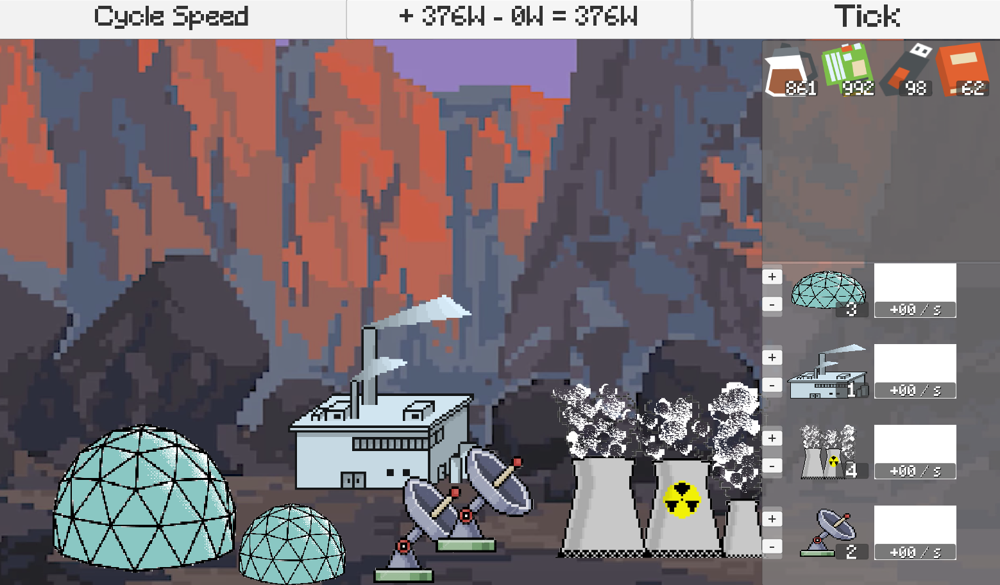

# SpaceColony

This repository contains C# scripts and placeholder sprite assets for my 2D Space Colony game.

# Scripts

Scripts can be found in the [Assets/Scripts](./Assets/Scripts) folder. 

# Features

The game is in an early prototype phase, focusing on developing the item production/consumption logic, inventory and buildings.

Current features:
- Variable game speed (with uncapped framerate) 1x, 2x, 4x, 8x
- Power consumption UI
- Item inventory panel
    - Updates with item consumption/production
- Building inventory panel 
    - Add or remove buildings

# Planned Features

- Buildings require colonists to operate
    - Colonists have needs to surive
- Research tree to unlock new buildings/item recipes
    - Extensive production chains with multiple resources/byproducts
- Multiple colonies accross several planets
    - Interplanetary logistic system

# Screenshots

Below is a screenshot of the early prototype

